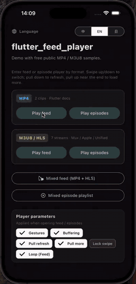

# flutter_feed_player

Vertical **short-video feed** and **series episode** players for Flutter, built on [`video_player`](https://pub.dev/packages/video_player).

Extracted from production TikTok-style / binge-episode UX patterns (parked controller promote, adjacent warm-up, exclusive audio). Host apps inject playable data — **no backend client is included**.

## Demo

Swipe feed, pull-to-refresh, and load-more in the example app:



## Features

| Layer | Widget | Use case |
|-------|--------|----------|
| Convenience | `FeedPlayer` / `EpisodePlayer` | View + default chrome |
| Core | `FeedPlayerView` / `EpisodePlayerView` | Surface + gestures only |
| Components | `FeedPlayerChrome` / `EpisodePlayerChrome` | Default overlays (replace freely) |

- Park / promote `VideoPlayerController` map for instant swipe
- Adjacent preload with ~2s warm buffer
- Exclusive unmute (one audible player at a time)
- Tap play/pause, long-press 2×, seek bar, speed sheet (episode)
- Pull-to-refresh on first page / pull-up load-more on last page
- Optional `HttpHeadersProvider` / `UrlTransformer` for CDN auth

Player core and UI components are separated: keep the view, swap chrome via `overlayBuilder`.

---

## 接入流程（Integration）

整体顺序：**依赖 → 数据映射 → Controller + loader → 选一层 Widget → 生命周期**。包内不含网络客户端，由宿主把接口 DTO 转成 `FeedItem` / `SeriesInfo`。

```
Host API / mock
      │  map → FeedItem / SeriesInfo / EpisodeItem
      ▼
FeedPlayerController / EpisodePlayerController   (loader 分页)
      ▼
┌─────────────────┬──────────────────┐
│ FeedPlayer      │ FeedPlayerView   │  ← 推荐流
│ EpisodePlayer   │ EpisodePlayerView│  ← 剧集
└────────┬────────┴────────┬─────────┘
         │ default chrome  │ overlayBuilder 自由拼装
         ▼                 ▼
   FeedPlayerChrome   FeedBottomChrome / FeedSideActions / …
```

### 1. 添加依赖

```yaml
dependencies:
  flutter_feed_player: ^0.1.1
```

```sh
flutter pub get
```

平台要求与 [`video_player`](https://pub.dev/packages/video_player) 一致（iOS / Android / Web 等）。确保目标平台已按该插件文档完成配置（如 Android 网络权限、iOS ATS）。

### 2. 映射播放数据

宿主接口返回什么都可以，**最终必须变成**下列模型再交给 loader：

| 模型 | 用途 |
|------|------|
| `FeedItem` | 推荐流单卡（标题、点赞、内嵌 `EpisodeItem` 等） |
| `EpisodeItem` | 单集；用 `playUrl` 或 `assets[].url` |
| `EpisodeAsset` | 多清晰度 / 多 locale CDN 资源 |
| `SeriesInfo` | 剧集元数据 + `episodes` 列表 |

播放地址解析：`playUrl` 优先；为空则取 `assets` 中第一个非空 `url`。含 `/v{n}/index.m3u8` 的 HLS 地址会在工厂层尽量归一到 `master.m3u8`。

```dart
import 'package:flutter_feed_player/flutter_feed_player.dart';

FeedItem mapFeedDto(YourFeedDto dto) {
  return FeedItem(
    id: dto.id,
    seriesId: dto.seriesId,
    title: dto.title,
    coverUrl: dto.cover,
    description: dto.desc,
    tags: dto.tags,
    likeCount: dto.likes,
    isLiked: dto.liked,
    ctaText: 'Watch full series',
    episode: EpisodeItem(
      episodeId: dto.episodeId,
      episodeNo: dto.episodeNo,
      playUrl: dto.streamUrl, // MP4 或 .m3u8
      // 或：assets: [EpisodeAsset(assetType: 'hls', url: dto.hlsUrl)],
    ),
  );
}

SeriesInfo mapSeriesDto(YourSeriesDto dto, List<YourEpDto> page) {
  return SeriesInfo(
    seriesId: dto.id,
    title: dto.title,
    coverUrl: dto.cover,
    description: dto.desc,
    episodes: page
        .map(
          (e) => EpisodeItem(
            episodeId: e.id,
            episodeNo: e.no,
            title: e.title,
            playUrl: e.url,
          ),
        )
        .toList(),
  );
}
```

### 3. 推荐流（Feed）接入

**步骤：**

1. 实现 `FeedPageLoader`：`(page) → Future<List<FeedItem>>`，页码从 **1** 开始；没有更多时返回 **空列表**（或长度 `< pageSize`）。
2. 创建 `FeedPlayerController`（与 `pageSize` 对齐，便于判断 `hasMore`）。
3. 在 `State.initState` 里创建 Controller，在 `dispose` 里 `controller.dispose()`。
4. 挂载 `FeedPlayer`（默认 UI）或 `FeedPlayerView`（自定义 chrome）。

```dart
class FeedPage extends StatefulWidget {
  const FeedPage({super.key});

  @override
  State<FeedPage> createState() => _FeedPageState();
}

class _FeedPageState extends State<FeedPage> {
  static const _pageSize = 10;
  late final FeedPlayerController _controller;

  @override
  void initState() {
    super.initState();
    _controller = FeedPlayerController(
      loader: (page) async {
        final list = await yourApi.fetchFeedPage(page, size: _pageSize);
        return list.map(mapFeedDto).toList();
      },
      pageSize: _pageSize,
      loopClips: true,              // 短视频循环
      lockForwardWhileCold: false,  // HLS 冷启动时建议保持 false
      // headersProvider / urlTransformer — 见下文 CDN
    );
  }

  @override
  void dispose() {
    _controller.dispose();
    super.dispose();
  }

  @override
  Widget build(BuildContext context) {
    return Scaffold(
      backgroundColor: Colors.black,
      body: FeedPlayer(
        controller: _controller,
        bottomInset: MediaQuery.paddingOf(context).bottom,
        onWatchFullSeries: (index) {
          final item = _controller.items[index];
          // 跳转 EpisodePlayer，传入 seriesId / 起始集
        },
        onShare: (index) { /* 分享 */ },
      ),
    );
  }
}
```

`FeedPlayerView` 默认 `autoInit: true`，首帧会调用 `controller.init()` → `refresh()` 拉第 1 页。也可自行 `await controller.init()`。

**分页手势：**

| 手势 | 行为 | 开关 |
|------|------|------|
| 首页下拉 | `refresh()` | `enablePullToRefresh` |
| 末页上拉 | `loadMore()` | `enablePullToLoadMore` |
| 靠近末尾 | 自动预取下一页 | 内置 |

### 4. 剧集（Episode）接入

**步骤：**

1. 实现 `SeriesLoader`：`(page) → Future<SeriesInfo>`，页码从 **1** 开始。
2. **第 1 页必须带齐系列元数据**（`seriesId` / `title` / …）+ 本页 `episodes`。
3. **后续页只需填 `episodes`**（其它字段会被忽略）；空列表表示没有更多。
4. 可选 `initialEpisodeId` / `initialEpisodeNo` 定位开播集。
5. 挂载 `EpisodePlayer` 或 `EpisodePlayerView`。

```dart
class SeriesPage extends StatefulWidget {
  const SeriesPage({super.key, required this.seriesId});

  final String seriesId;

  @override
  State<SeriesPage> createState() => _SeriesPageState();
}

class _SeriesPageState extends State<SeriesPage> {
  static const _pageSize = 10;
  late final EpisodePlayerController _controller;

  @override
  void initState() {
    super.initState();
    _controller = EpisodePlayerController(
      loader: (page) async {
        final raw = await yourApi.fetchSeriesPage(
          widget.seriesId,
          page: page,
          size: _pageSize,
        );
        return mapSeriesDto(raw.meta, raw.episodes);
      },
      pageSize: _pageSize,
      initialEpisodeNo: 1,
      lockForwardWhileCold: false,
    );
  }

  @override
  void dispose() {
    _controller.dispose();
    super.dispose();
  }

  @override
  Widget build(BuildContext context) {
    return Scaffold(
      backgroundColor: Colors.black,
      body: EpisodePlayer(
        controller: _controller,
        onBack: () => Navigator.of(context).maybePop(),
        onShare: () { /* 分享 */ },
        onOpenEpisodeList: () { /* 选集面板 */ },
      ),
    );
  }
}
```

### 5. 选择接入层级

| 需求 | 用法 |
|------|------|
| 最快上线、默认 TikTok 风格 UI | `FeedPlayer` / `EpisodePlayer` |
| 完全自定义浮层 | `FeedPlayerView` / `EpisodePlayerView` + `overlayBuilder` |
| 半定制 | `overlayBuilder` 里混用 `FeedBottomChrome`、`FeedSideActions` 等积木 |

#### 自定义 chrome（推荐流）

```dart
FeedPlayerView(
  controller: controller,
  overlayBuilder: (context, slot) {
    if (!slot.isActive) return const SizedBox.shrink();
    return Stack(
      children: [
        if (slot.controller.showCenterPlay) const FeedCenterPlayIcon(),
        FeedSideActions(
          bottomInset: 0,
          liked: slot.item.isLiked,
          likeCount: slot.item.likeCount,
          onLike: () => slot.controller.toggleLike(slot.index),
        ),
        FeedBottomChrome(
          bottomInset: 0,
          title: slot.item.title,
          description: slot.item.description,
          tags: slot.item.tags,
          ctaText: slot.item.ctaText,
          formatLabel: slot.item.formatLabel,
          seekController: slot.player,
        ),
        // 也可完全自绘，使用 slot.controller / slot.item / slot.player
      ],
    );
  },
);
```

剧集侧同理：用 `EpisodePlayerSlot` + `EpisodeTopBar` / `EpisodeBottomChrome` / `EpisodeCenterControl` 等，或整页换成自己的 UI。

`loadingBuilder` / `errorBuilder` 可替换首屏加载、空列表错误壳。

### 6. CDN 鉴权 / URL 改写（可选）

在 Controller 构造时注入：

```dart
FeedPlayerController(
  loader: loader,
  headersProvider: ({required url, required isHls}) => {
    'Authorization': 'Bearer $token',
    if (!isHls) 'User-Agent': 'MyApp/1.0',
  },
  urlTransformer: (url) => appendExpireQuery(url),
);
```

`EpisodePlayerController` 参数相同。

### 7. 生命周期与其它约定

- **必须**在宿主 `State.dispose` 中调用 `controller.dispose()`，释放 parked / active 播放器。
- 页面不可见时，View 会配合暂停；需要后台播放可设 `allowBackgroundPlayback: true`（慎用）。
- Demo 在 `main` 里调用了 `PlaybackMemory.init()`（记忆进度）；宿主按需同样初始化。
- `FeedItem.identity` / `episodeId` 尽量稳定唯一，便于 park 缓存命中。
- 从 Feed 进剧集：在 `onWatchFullSeries` 里 `Navigator.push` 打开带同一 `seriesId` 的 `EpisodePlayer`。

### 8. 接入检查清单

- [ ] `pubspec` 依赖 `flutter_feed_player`
- [ ] DTO → `FeedItem` / `SeriesInfo` / `EpisodeItem`，且 `playUrl` 或 `assets` 可播
- [ ] `loader` 分页从 1 开始；耗尽返回空列表；`pageSize` 与接口一致
- [ ] 剧集第 1 页带系列元数据
- [ ] `Controller` 在 `dispose` 中释放
- [ ] 选用 `*Player` 或 `*PlayerView` + chrome
- [ ] 需要鉴权时配置 `headersProvider` / `urlTransformer`
- [ ] 真机验证竖滑、下拉刷新、上拉加载、音画互斥

---

## Quick start — feed

```dart
final controller = FeedPlayerController(
  loader: (page) async {
    // Map your API (or mock) → List<FeedItem>
    return mockFeedPage(page);
  },
);

FeedPlayer(
  controller: controller,
  onWatchFullSeries: (index) { /* open EpisodePlayer */ },
);
```

## Quick start — episodes

```dart
final controller = EpisodePlayerController(
  loader: (page) async => mockSeriesPage(page),
  pageSize: 10,
  initialEpisodeNo: 1,
);

EpisodePlayer(controller: controller);
```

## Demo

```sh
cd example
flutter run
```

The example ships feed / episode demos with public sample streams (MP4 + HLS). Demo pages compose chrome via `overlayBuilder`.

## Models

```dart
FeedItem / EpisodeItem / EpisodeAsset / SeriesInfo
```

Provide `playUrl` and/or `assets[].url`. HLS URLs containing `/v{n}/index.m3u8` are normalized to `master.m3u8` when applicable.

## Public chrome building blocks

**Feed:** `FeedPlayerChrome`, `FeedCenterPlayIcon`, `FeedSideActions`, `FeedBottomChrome`, `PlayerSeekBar`

**Episode:** `EpisodePlayerChrome`, `EpisodeTopBar`, `EpisodeCenterControl`, `EpisodeSideActions`, `EpisodeBottomChrome`, `EpisodeBoostBadge`

## License

MIT
